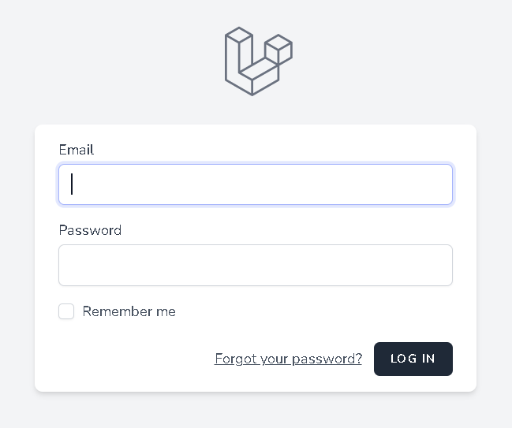

# ticket tracking system

# Table of Contents
- [背景知識](#背景知識)
- [安裝](#安裝)
- [如何使用](#如何使用)
    - [啟用產生短網址服務](#啟用產生短網址代碼服務)
- [api](#api)
    - [建立短網址](#建立短網址)
    - [短網址轉址](#短網址轉址)
- [Maintainers](#maintainers)

## 背景知識
這個專案用來追蹤 ticket 的進度  
目前有這些 ticket：  
1. Bug
2. Feature request
3. Test case

會有四種身分的角色  
1. Admin：管理所有使用者
2. PM：建立或編輯 Feature request
3. QA：建立或編輯 Bug 與 Test case，並且可以結案 Test case
4. RD：可以結案 Bug 與 Feature request

## 安裝
### 一般安裝，例如在 linux 環境中安裝
執行 git clone 後，請先在 `.env` 修改資料庫連線資訊
```dotenv
DB_HOST=127.0.0.1   # 資料庫的位址
DB_PORT=3306        # 資料庫的 port
DB_DATABASE=ticket  # 資料庫名稱
DB_USERNAME=root    # 使用者名稱
DB_PASSWORD=123456  # 使用者密碼
```

接著在專案目錄下執行下列指令安裝
```shell
# 安裝 packages
$ composer install

# 執行資料庫遷移
$ php artisan migrate
```

### 使用 docker compose
執行 git clone 後，請先在 `.env` 修改資料庫連線資訊
```dotenv
DB_HOST=mysql       # 資料庫的位址，使用 docker 安裝時請保持 `mysql`
DB_PORT=3306        # 資料庫的 port
DB_DATABASE=ticket  # 資料庫名稱
DB_USERNAME=root    # 使用者名稱
DB_PASSWORD=123456  # 使用者密碼
```

接著在專案目錄下執行下列指令安裝
```shell
# 執行 docker compose 來 pull image
docker compose up -d

# 安裝 packages
$ docker compose exec ticket composer install

# 執行資料庫遷移
$ docker compose exec ticket php artisan migrate

# 將網址加入 hosts
echo "127.0.0.1 ticket.test" >> /etc/hosts
```

# 如何使用
## 登入
進入系統前須先登入，目前已有的預設帳號如下：
1. Email: admin@example.com, Password: adminadmin123。身分是 admin
2. Email: pm@example.com, Password: pmpmpm123。身分是 pm
3. Email: qa@example.com, Password: qaqaqa123。身分是 qa
4. Email: rd@example.com, Password: rdrdrd123。身分是 rd

請於登入畫面中輸入 email 與 password  


## 進入 ticket tracking system

## 新建一筆

## 編輯

## 結案

## Maintainers
[@thinklikes](https://github.com/thinklikes).
